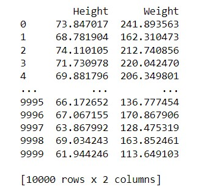
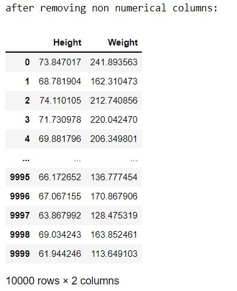
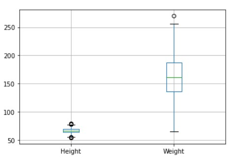
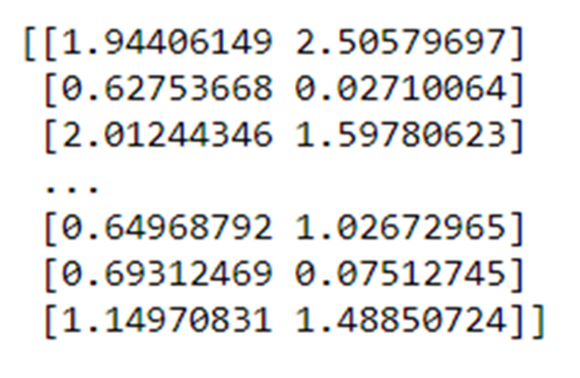
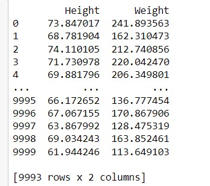
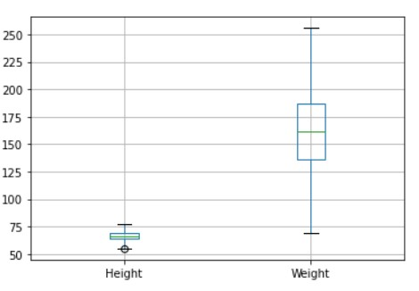
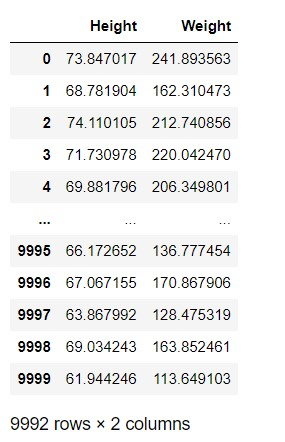
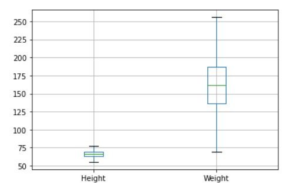
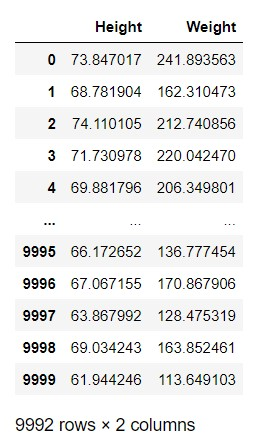

# Ex-02_DS_Outlier

# AIM
To read the given data and perform cleaning of unwanted data that are not relevant to the data set(outlier) and save the cleaned data to a file.

# EXPLANATION
Outlier is a data object that deviates significantly from the rest of the data objects and behaves in a different manner. They can be caused by measurement or execution errors. The analysis of outlier data is referred to as outlier analysis or outlier mining. The box plot is a useful graphical display for describing the behavior of the data in the middle as well as at the ends of the distributions. The box plot uses the median and the lower and upper quartiles (defined as the 25th and 75th percentiles). If the lower quartile is Q1 and the upper quartile is Q3, then the difference (Q3 - Q1) is called the interquartile range or IQ.

# ALGORITHM
### STEP 1
Import the required packages(pandas,numpy,scipy)
### STEP 2
Read the given csv file 
### STEP 3
Convert the file into a dataframe and get information of the data.
### STEP 4
Remove the non numerical data columns using drop() method.
### STEP 5
Detect the outliers in the data set using z scores method.
### STEP 6
Remove the outliers by z scores and list manupilation or by using Interquartile Range(IQR)
### STEP 7
Check if the outliers are removed from data set using graphical methods.
### STEP 8
Save the final data set into the file

# PROGRAM
```
import pandas as pd
df=pd.read_csv('Weight.csv')
print(df.to_string())

#removing non numerical columns
df=df.drop("Gender",axis=1)
print("after removing non numerical columns:")
print(df)

#graph to display outliers
df.boxplot()

#calculating zscores to determine outliers
import numpy as np
from scipy import stats
z=np.abs(stats.zscore(df))
print(z.to_string())

#removing outliers from weight
df1=df.copy()
df1=df1[(z<3).all(axis=1)]
print(df1.to_string())

#checking if outliers are removed throught graph
df1.boxplot()

#removing outliers from height
df2=df2.copy()
q1=df2.quantile(0.25)
q3=df2.quantile(0.75)
IQR=q3-q1
df_new=df2[((df2>=q1-1.5*IQR)&(df2<=q3+1.5*IQR)).all(axis=1)]
df_new

#checking if outliers are removed through graph
df_new.boxplot()

#final dataset
df.new

#saving data file
df.to_csv('weight.csv', index=False)
```
# OUTPUT
### INITIAL DATA SET:


### DATA SET AFTER REMOVING NON NUMERICAL COLUMNS:


### GRAPH DISPLAYING INITIAL DATASET WITH OUTLIERS:


### ZSCORES TO DETECT OUTLIERS


### DATA SET AFTER REMOVING OUTLIERS IN WEIGHT USING Z SCORES AND LIST MANIPULATION:


### GRAPH AFTER GRAPH REMOVING OUTLIERS IN WEIGHT:


### DATA SET AFTER REMOVING OUTLIERS IN HEIGHT USING INTERQUARTILE RANGE (IQR):


### FINAL GRAPH AFTER REMOVING ALL OUTLIERS:


### FINAL DATASET:


# RESULT
Thus the outliers are detected and removed in the given file and the final data set is saved into the file.


